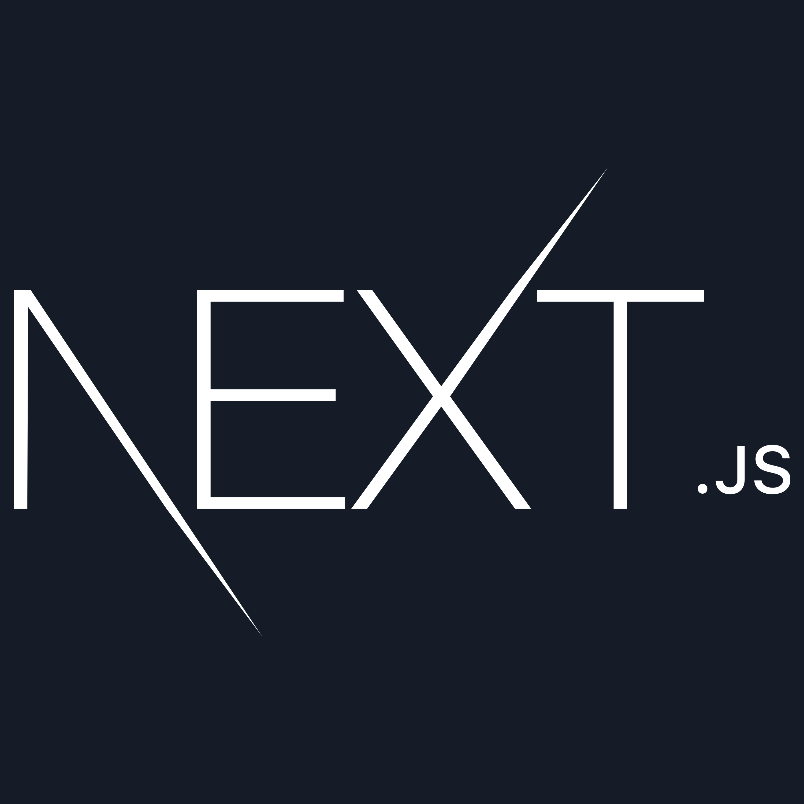

<h1 align="left">Hi 👋, I'm Rakib 👨🏻‍💻</h1>

---

### 👨‍💻 About Me

I'm a passionate **junior MERN stack web developer** dedicated to transforming ideas into user-friendly and engaging digital experiences.

- 💻 Specializing in the **MERN stack** (MongoDB, Express.js, React.js, Node.js), I enjoy building dynamic and responsive web applications, from intuitive user interfaces to robust backend systems.
- 🎓 With a strong foundation in **computer science**, I stay up-to-date with the latest technologies, allowing me to bring fresh, cutting-edge solutions to my projects.
- 📚 Currently, I’m on a journey to enhance my skills and explore collaborative opportunities to contribute to innovative and impactful projects.

🌟 **Let's collaborate** to craft extraordinary digital experiences! Feel free to connect for any web development needs.

---

## 📊 Current Stats

  

---

## 📬 Let's Connect

  
  

---

## 💻 Technologies I Know

  
  
  
  
  

  
  
  
  
  
  

  
  
  
  

