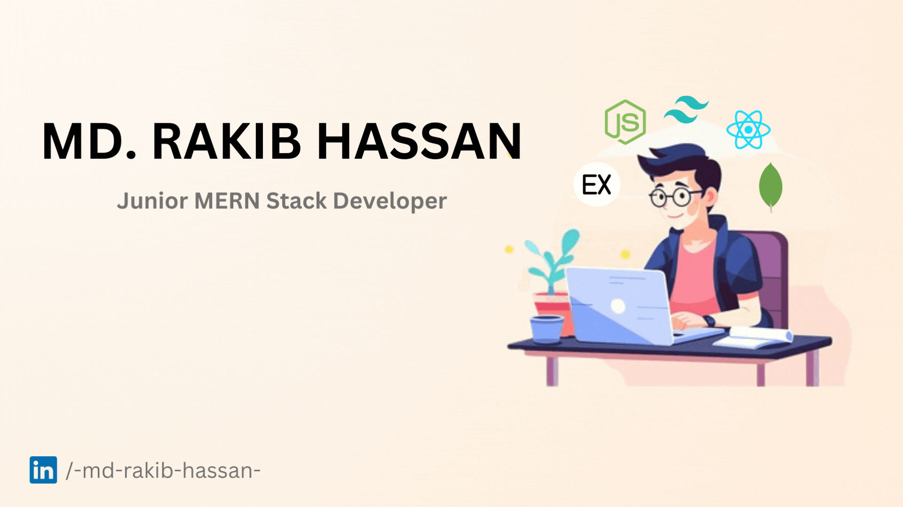

<h1 align="left">Hi 👋, I'm Rakib👨🏻‍💻</h1>

I'm a passionate junior MERN stack web developer with a knack for turning ideas into interactive and user-friendly digital experiences.

💻 As a MERN (MongoDB, Express.js, React.js, Node.js) stack enthusiast, I thrive on creating dynamic and responsive web applications. From designing user interfaces to implementing robust backend functionalities, I am committed to delivering seamless and engaging digital experiences.

🎓 I hold a solid foundation in computer science and constantly stay updated with the latest trends and technologies in the rapidly evolving tech landscape. This allows me to bring fresh and cutting-edge solutions to the projects I undertake.

📚 Currently on the exciting journey of honing my skills and expanding my knowledge base, I am open to new challenges and collaborative opportunities that allow me to contribute to innovative projects.

🌟 Let's collaborate and craft something extraordinary! Feel free to reach out for all your web development needs.

## :chart_with_upwards_trend: Current Stats

 

  

## :mailbox: Reach me out

 

 

## :computer: Technologies that I know

 

 